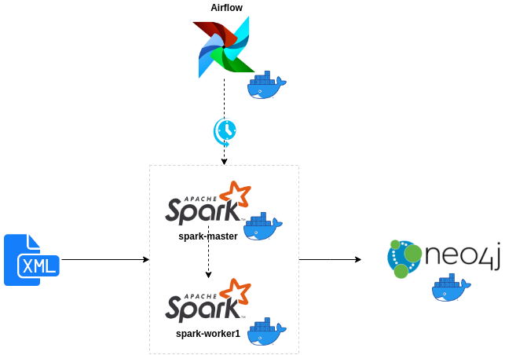
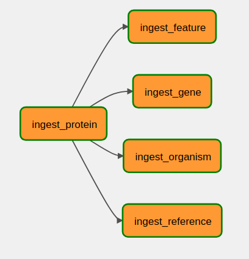

# BioTech Data Pipeline

This project implements a sample data pipeline to load data from a XML file into a
Neo4j database.

## The Data

A sample XML file called `Q9Y261.xml` is located in the `data/uniprot` directory.
The XML contains information about proteins, associated genes 
and other biological entities. The root element of the XML 
is `uniprot`. Each `uniprot` element contains an`entry` element. 
Each `entry` element contains various elements such as 
`protein`, `gene`, `organism` and `reference`. 


The data is modeled as a graph on Neo4J. The graph should contain 
nodes for proteins, genes, organisms, references, and more. 
The graph contain edges for the relationships between 
these nodes. The relationships are based on the
[XML schema](https://ftp.uniprot.org/pub/databases/uniprot/current_release/knowledgebase/complete/uniprot.xsd). 
For example, the `protein` element contains a `recommendedName` 
element. The `recommendedName` element contains a `fullName` element. 
The `fullName` element contains the full name of the protein. 
The graph contains an edge between the `protein` node and 
the `fullName` node.

## The Architecture

The main tools used for this solution were:

* **Processing**: Apache Spark is a unified analytics engine for large-scale 
data processing with built-in modules for SQL, streaming, 
machine learning, and graph processing.

* **Orchestration**: Apache Airflow platform to programmatically author, schedule and 
monitor workflows.

* **Storage**: Neo4J is the world’s leading Graph Database. It is a high performance 
graph store with all the features expected of a mature and robust 
database, like a friendly query language and ACID transactions. 

* **Containers**: Docker is an open source platform that enables developers to build, 
deploy, run, update and manage containers—standardized, executable 
components that combine application source code with the operating 
system (OS) libraries and dependencies required to run that code 
in any environment.




A DAG in Airflow (`ingest_uniprot_protein_data`) is responsible for orchestrating the spark jobs that
read all XML files in `data/uniprot` and write them into the Neo4J instance.
Each XML file in source folder should contain information about a distinct protein.
The file should be named after a protein's name.
In order to ingest data about any new protein into Neo4J, the only necessary
step is to create a new XML file in the source folder.



Each step of the pipeline is responsible for loading part of 
the entities extracted from the XML files, running steps 
in parallel whenever possible (respecting dependencies).

### How to scale

The current architecture uses only one spark worker. In case this single worker no longer supports the current data processing 
requirements, new spark workers could be added anytime or a managed
spark cluster solution could be explored.


### Next steps

This architecture could be even more resilient by replacing its
components by some managed options available on public cloud vendors,
like:

* Airflow: could be replaced by [Cloud Composer](https://cloud.google.com/composer?hl=pt-br);
* Spark cluster: could be replaced by [Databricks](https://www.databricks.com/), [AWS EMR](https://aws.amazon.com/emr/?nc1=h_ls) or [Dataproc](https://cloud.google.com/dataproc?hl=pt-br);
* Neo4J: enterprise version on [AWS](https://aws.amazon.com/solutions/partners/neo4j-graph-database/) or [Azure](https://azuremarketplace.microsoft.com/en-us/marketplace/apps/neo4j.neo4j-ee?tab=Overview).


## How to execute

Setup:

* Install [docker](https://docs.docker.com/engine/install/)
* Install [compose](https://docs.docker.com/compose/install/)

Execute:
```sh
docker compose build
docker compose up 
```

Airflow UI: 
* url: http://localhost:8080/
* user: airflow
* password: airflow

Neo4j: 
* host: localhost
* port: 7687
* user: neo4j
* password: neo4j_pass

Spark UI:
* url: http://localhost:9090/


# Results

You can check the data loaded into Neo4j using the queries below:

```buildoutcfg

MATCH (p:Protein)
RETURN p
LIMIT 10

MATCH (a)-[:IN_ORGANISM]->(b)
RETURN a, b

MATCH (a)-[:HAS_FULL_NAME]->(b)
RETURN a, b

MATCH (a)-[:FROM_GENE {status: 'synonym'}]->(b)
RETURN a, b

MATCH (a)-[:HAS_AUTHOR]->(b)
RETURN a, b
```
